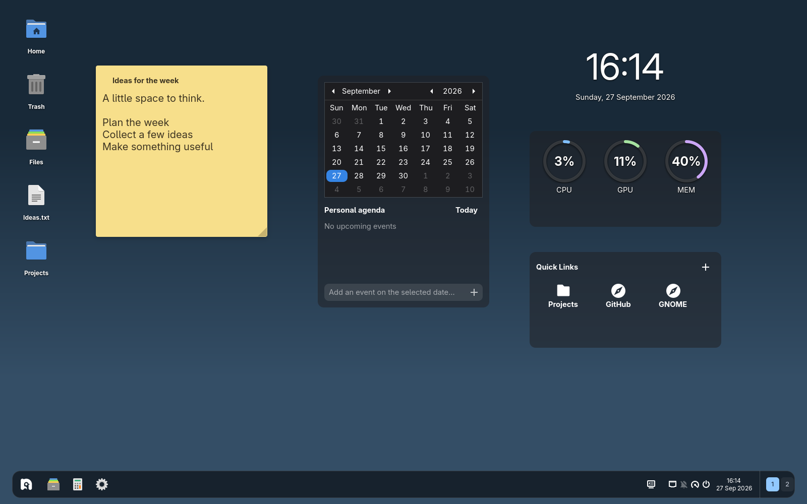

# Luna Desktop

**Make room for your notes, your apps, and your next idea.**

Desktop icons and customizable widgets for GNOME Shell 50 on Wayland. Keep the things you reach for every day on your desktop, and arrange them your way.



*A real test desktop with sample content. The taskbar shown is the separate [Luna Taskbar](https://github.com/Wuild/luna-taskbar) extension.*

## Put your desktop to work

- **Leave yourself a note.** Sticky notes support multiple instances, colors, rich text, and direct editing.
- **Build your own widget layout.** Add a clock, weather, calendar and personal agenda, quick links, Now Playing, system resource rings, or storage information.
- **Make it yours.** Move and resize widgets; choose backgrounds, opacity, corner radius, and widget-specific options.
- **Keep useful files close.** Desktop files, folders, standard `.desktop` application launchers, Home, Trash, and mounted drives are supported.
- **Arrange once.** Drag icons into place, snap to a grid, and keep display-aware positions as your workspace changes.
- **Bring apps to the desktop.** Optional **Add to Desktop / Remove from Desktop** actions appear in GNOME’s application grid.

## Start making it yours

Right-click the desktop and choose **Edit Desktop** to add, move, resize, and customize widgets. Open preferences for the full set of icon and widget controls; search helps you find a setting quickly.

Desktop icons are on initially. Turn on widgets in **Desktop Widgets → Show desktop widgets**. Icons and widgets can be enabled independently.

Weather uses network access. Now Playing follows compatible media players; its optional visualizer uses `pactl` and `parec`, with spectrum processing in GJS.

In Now Playing’s widget settings, **Show playing app name and icon** controls the player header. Enable **Audio visualizer (selected app)**, then choose **Visualizer placement → Below track details** or **Widget background**. The background placement draws a subdued spectrum behind the track details and playback controls. Bar count, update rate, sensitivity, and gradient, solid, or album-artwork colors are configurable.

## Window tiling

Open **Desktop Settings → Tiling** to enable or disable tiling, the top layout bar, and suggestions for empty tiles. **Window spacing** controls gaps between tiles and at screen edges (0–48 logical pixels); changing it updates existing grids. Tiling is enabled by default and temporarily replaces GNOME's edge tiling; disabling it restores the previous edge-tiling setting.

- Drag to a left or right edge for halves, or a corner for quarters.
- Dragging a maximized window restores it while keeping the layout tab available on either display, including when the taskbar changes the usable screen area.
- Moving a window reveals a compact tab attached to the top edge. Hover the tab to slide down the layout bar, hover a position, and release. Moving away collapses the bar. The collapsed tab keeps the expanded bar’s width and shares App switcher transparency/blur settings. Choose halves, thirds, a large left pane, a main pane with two smaller panes, quarters, or Maximize. Releasing at the top edge outside a layout tile maximizes the window.
- Windows snapped separately into available positions of the same layout join its existing grid, including its resized proportions.
- Pick another open window from the current workspace and monitor to fill the next empty tile. Suggestions appear as a vertically centered masonry grid without a panel background. Click anywhere outside an app card, or press Escape, to dismiss.
- Hover between snapped windows to reveal a shared divider, then drag it or resize a snapped window’s shared edge to resize the whole grid. Window minimum sizes constrain resizing. Moving or closing a member removes that window while keeping the remaining grid. Groups stay associated with their workspace and reflow when the screen or usable area changes, including Devkit window resizing.
- Press **Super+Z** for a compact layout flyout beside the focused window. Use Tab and Enter to choose a position, or Escape to cancel.
- Press **Super+Ctrl+Left/Right** for a half; follow with **Super+Ctrl+Up/Down** for a corner.

Luna’s own Alt+Tab switcher shows individual windows and snap groups together. Both GNOME “switch applications” and “switch windows” shortcuts open this unified view. Cards have an app-icon/title header and window preview; group cards show their tile arrangement. Selecting a group unminimizes and raises its members on their workspace while preserving split ratios. Hover an individual window card to reveal its close button; it requests a normal app close, removes the card when the window closes, and keeps the switcher open for the remaining windows. Alt+Shift+Tab cycles backward; releasing Alt or pressing Enter selects, and Escape cancels. Turn **Luna Alt+Tab switcher** off under **App switcher** to restore GNOME switching. The existing window-switcher workspace filter is respected. Cards use a fixed preview height and aspect-based widths with a minimum width; previews fit without cropping or stretching, leaving space where needed. App switcher appearance controls include transparency, opacity, blur, background color, corners, padding and card spacing. Defaults match Taskbar panels/previews: 56% opacity, blur 12, 12px corners, 6px padding and 6px card spacing. The panel fits its content and wraps at the configurable **Maximum panel width** (80% by default). Tall grids scroll, and Up/Down moves between rows. Both switcher and recommendation cards follow the system light/dark style; recommendations keep their masonry layout.

Panels use the Shell theme with modest corner rounding. Snap ghosts and layout tiles follow the current system accent with a muted translucent fill. The recommendation grid has a translucent neutral backdrop to separate previews from windows behind it. Panel reveals and dismissals, hover highlights, snap previews, and window placement animate when GNOME animations are enabled. With the optional native helper, **Square corners while tiled** is experimental and off by default. It gives apps their maximized appearance inside the tile and restores normal state on unsnap. Apps decide how to draw that state and may remember it as the default for new windows (including Nautilus). Leave this option off to avoid that side effect; use shared dividers to resize these windows when enabled. Without the helper, normal app decoration state is preserved.

Application-drawn maximize buttons do not expose a universal Shell trigger, so holding maximize is not supported. Use Super+Z for the equivalent layout chooser. Groups are session-only and do not add taskbar group entries. Other tiling extensions should be disabled to avoid competing window placements.

### Optional native tiling helper

The native helper lets Mutter enforce each window's current grid rectangle and enables maximized styling inside a tile. Build it against **Mutter 50 / Meta 18** development headers, with a C compiler, pkg-config, Python 3, and GObject Introspection tools:

```sh
pnpm build:native
pnpm build
```

On Fedora-family systems, the headers are provided by `mutter-devel`. The helper is a shared library loaded by GNOME Shell, not a separate daemon. It is specific to the CPU architecture and Mutter ABI; rebuild it after changing either. The regular build includes a matching cached helper from `native/build/`; if absent, tiling runs without native constraints and square-corner styling. Native artifacts are not tracked in Git. The standard `pnpm run pack` ZIP excludes native libraries for extensions.gnome.org. For your own local installation with the helper, use `pnpm run pack:local`; its ZIP is written to `/tmp/luna-desktop-local-build/`. Do not submit the local package to extensions.gnome.org.

## Install

Requires **GNOME Shell 50 on Wayland**, GJS, GTK 4, and libadwaita. Disable any other desktop-icon extension before enabling Luna Desktop.

Build the extension with Node.js 22+, pnpm, Python 3, and GLib schema tools:

```sh
git clone https://github.com/Wuild/luna-desktop.git
cd luna-desktop
pnpm install --frozen-lockfile
pnpm run pack
gnome-extensions install --force /tmp/luna-desktop-build/luna-desktop@wuild.shell-extension.zip
```

Log out and back in, then enable **Luna - Desktop** in GNOME’s Extensions app, or run:

```sh
gnome-extensions enable luna-desktop@wuild
```

After installing an update, log out and back in to load the new code. Your desktop files remain in your normal Desktop folder. Widget layouts, preferences, and saved content persist separately.

## Build a Luna desktop

Each extension works on its own. Combine the pieces you want:

| Project | What it brings |
| --- | --- |
| [Luna Taskbar](https://github.com/Wuild/luna-taskbar) | App groups, animated previews, a system tray, and calendar/system panels |
| [Luna Wallpaper](https://github.com/Wuild/luna-wallpaper) | Daily images and wallpaper rotation; adds **Change wallpaper** to Desktop’s context menu |
| [Luna Devkit](https://github.com/Wuild/luna-devkit) | A separate GNOME session for experimenting with the whole setup |

Also from the same author: [Mutter Unmuted](https://github.com/Wuild/mutter-unmuted), an experimental, opt-in Mutter/Xwayland patch pair for legacy X11 push-to-talk across GNOME on Wayland, including Discord. It is a separate system-level project, not required by Luna; read its compatibility and input-forwarding notes before installing.

## For tinkerers

Create your own GTK widgets using the [Widget API](docs/widget-api.md), or explore the [desktop settings guide](docs/desktop-settings.md). Custom widgets are trusted local code with your user’s permissions.

```sh
pnpm typecheck
pnpm test
pnpm test:shell
```

The Shell tests run in a disposable headless session. Build output is in `dist/`. Saved widget state and custom widgets live in `~/.local/share/luna-desktop/` (or your `XDG_DATA_HOME`).

## Feedback

[Report a bug or suggest an idea](https://github.com/Wuild/luna-desktop/issues). Include your distribution, GNOME version, monitor layout/scaling, and the steps to reproduce it. Screenshots help!

## Extension review

See the [submission review notes](docs/extension-review.md) for packaging checks, lifecycle review, validation steps and remaining reviewer decisions. Passing local checks does not guarantee extensions.gnome.org approval.

## License

Copyright © 2026 Wuild. Licensed under [GPL-2.0-or-later](LICENSE). You are welcome to use, study, modify, and redistribute it under those terms.
